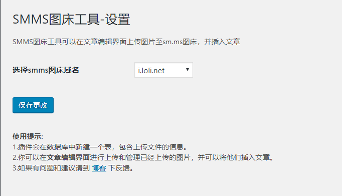
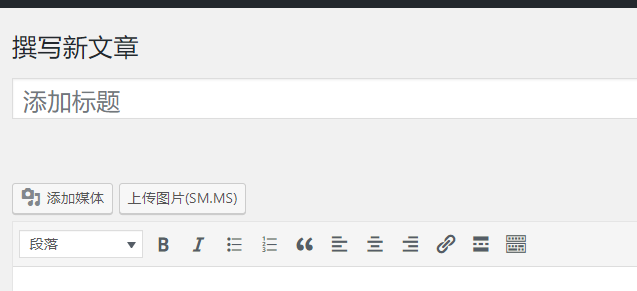
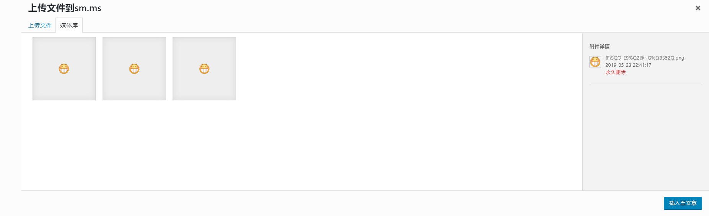

# WordPress smms 图床插件

> 一个适用于WordPress的smms图床插件，使用了 sm.ms 图床的api。实现了上传添加删除图片等功能。

## 使用指南

1. 下载插件
https://github.com/flylai/wordpress_smms_plugin/archive/master.zip
2. 打开wordpress插件管理界面，选择安装插件，上传，启用即可。

## 截图

##### 设置界面

##### 文章编辑界面

##### 图片管理界面

## 协议

MIT.